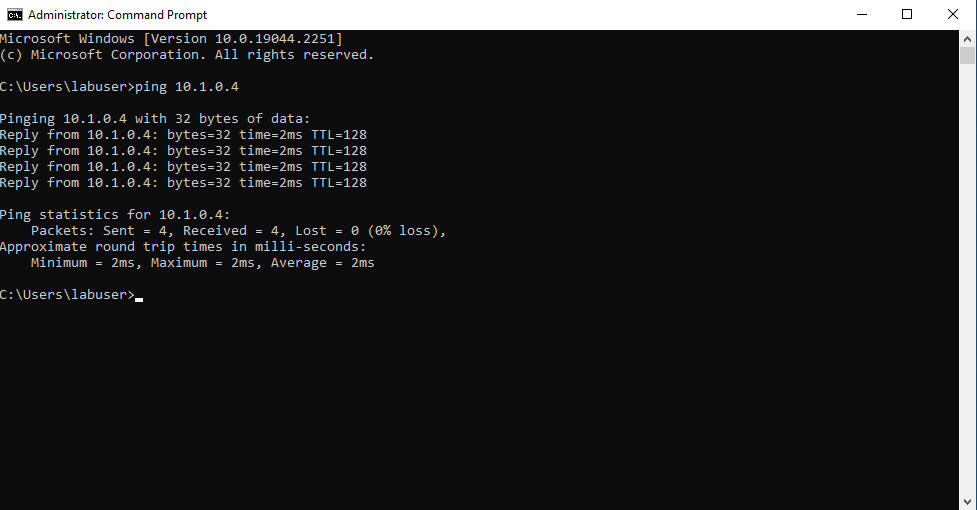
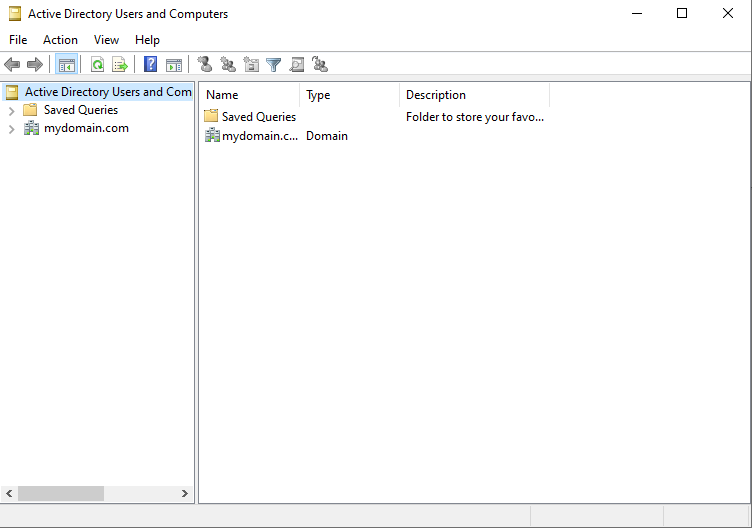
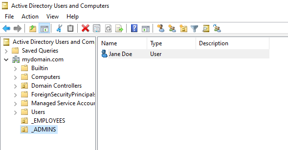
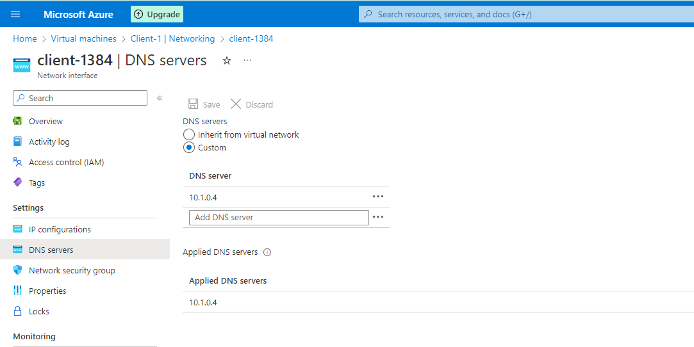
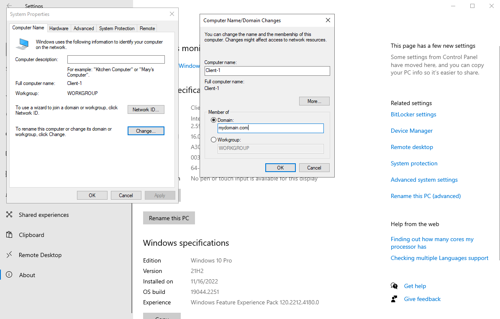
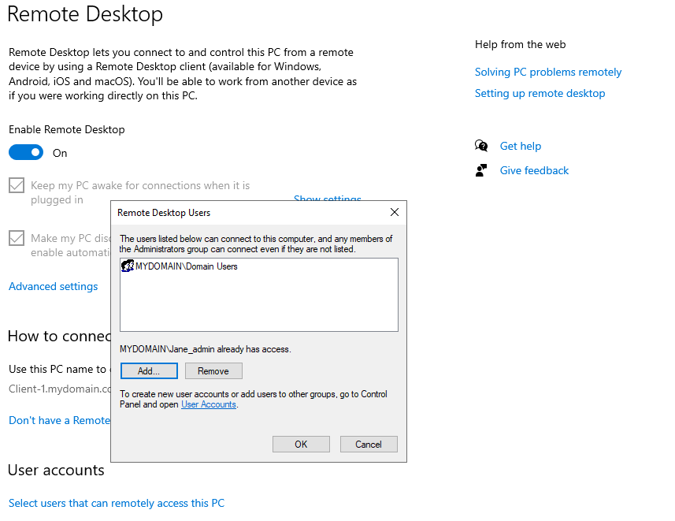
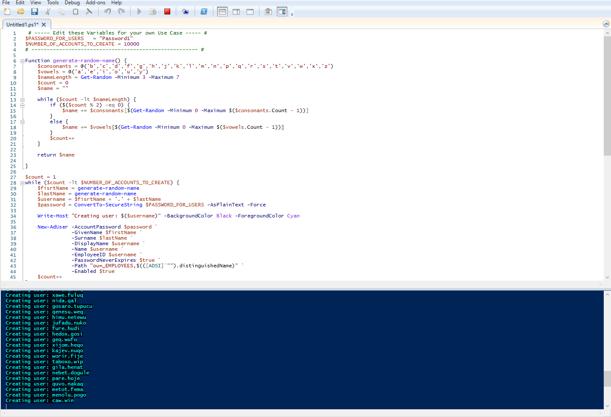
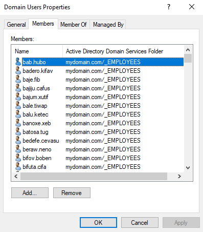
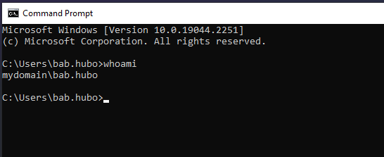

<h1>On-premises Active Directory Deployed in the Cloud (Azure)</h1>
This tutorial outlines the implementation of on-premises Active Directory within Azure Virtual Machines. 

<h2>Environments and Technologies Used</h2>

- Microsoft Azure (Virtual Machines/Compute)
- Remote Desktop
- Active Directory Domain Services
- PowerShell

<h2>Operating Systems Used </h2>

- Windows Server 2022
- Windows 10 (21H2)

<h2>Deployment and Configuration Steps</h2>

This lab provisions two virtual machines within the same Azure virtual network to simulate a basic on-premises Active Directory environment.

One virtual machine is configured as a Domain Controller, while the second serves as a client workstation. The Domain Controller is assigned a static private IP address to ensure consistent availability for Active Directory and DNS services.

The client machine is then joined to the domain and configured to use the Domain Controller as its primary DNS server, enabling proper name resolution and domain authentication.

 

 

The Domain Controller (DC-1) is assigned a static private IP address to ensure stable network communication with domain-joined clients.

To verify connectivity, the client machine (Client-1) attempts to ping DC-1. By default, the request fails due to ICMP traffic being blocked by the Windows firewall on the Domain Controller.

Inbound ICMPv4 rules are then enabled on DC-1, allowing the client machine to successfully reach the Domain Controller and confirm network connectivity.

 

 

DC-1 is used to install the Active Directory Domain Services role and associated management tools, including Active Directory Users and Computers.

The virtual machine is then promoted to a Domain Controller and configured with a new forest using the domain name mydomain.com. After promotion, the system is restarted to apply the configuration changes.

Once the restart is complete, DC-1 is accessed using the domain account mydomain.com\labuser. Successful configuration is confirmed by launching Active Directory Users and Computers, indicating that the domain services are operational.

 

 

Organizational Units (OUs) are created to establish basic directory structure and administrative separation within the domain.

Two OUs are defined at the domain level:

- \_EMPLOYEES

- \_ADMINS

Within these OUs, a new user account is created to represent an administrative user. The account Jane Doe is provisioned with the username Jane_admin and placed appropriately within the directory structure.

To grant elevated privileges, the user Jane_admin is added to the Domain Admins security group. This confirms both user creation and group-based privilege assignment within Active Directory.

 
 

 

The Jane_admin account is used as the administrative credential for subsequent domain operations.

To prepare the client machine for domain membership, Client-1 is configured to use the Domain Controller’s private IP address as its DNS server. This change is applied at the virtual network level to ensure proper name resolution during the domain join process.

After updating the DNS configuration, Client-1 is restarted from the Azure portal to apply the changes. Successful configuration is verified by confirming that Client-1 is resolving DNS requests through DC-1, as shown in the validation output below.

 

 

Client-1 is joined to the mydomain.com domain to complete the Active Directory integration.

The system is configured to change its domain membership and authenticated using valid domain credentials (mydomain.com\labuser). Once the domain join process is complete, the client machine is restarted to finalize the configuration.

After the restart, Client-1 is successfully enrolled in the domain and is managed under mydomain.com, confirming proper communication with the Domain Controller and Active Directory services.

 

With Client-1 successfully joined to the domain, Remote Desktop access is configured to support non-administrative domain users.

An administrator logs into Client-1 and updates the system’s Remote Desktop settings to allow access for Domain Users. This configuration enables standard domain accounts to establish remote sessions without requiring local administrative privileges.

Once applied, non-administrative users are able to successfully log into Client-1 via Remote Desktop, confirming that access controls are properly configured.

 

 

To validate Remote Desktop access for standard domain users, a PowerShell script is used to generate a large set of user accounts within the domain.

After the users are created, a non-administrative account is selected and used to initiate a Remote Desktop session to Client-1. Successful authentication and login confirm that domain users can access the client machine as intended.

This final step verifies both user provisioning at scale and proper Remote Desktop access configuration for non-privileged accounts.

 

 

 

 
The PowerShell provisioning script successfully generated a standard domain user with the username bab.hubo.

Using this account, a Remote Desktop session was established to Client-1 without administrative privileges. Successful login confirms that non-administrative domain users can authenticate and access the client machine as intended.
