

<h1>On-premises Active Directory Deployed in the Cloud (Azure)</h1>

This tutorial outlines the implementation of on-premises Active Directory within Azure Virtual Machines. 

<h2>Environments and Technologies Used</h2>

- Microsoft Azure (Virtual Machines/Compute)
- Remote Desktop (RDP)
- Active Directory Domain Services
- PowerShell
- Azure Virtual Network
- DNS

<h2>Operating Systems Used </h2>

- Windows Server 2025 Datacenter
- Windows 11 Pro

<h2>Deployment and Configuration Steps</h2>

- This lab provisions two virtual machines within the same Azure virtual network to simulate a basic on-premises Active Directory environment.

- Create a virtual network and subnet for both Virtual Machines to join (name: Active-Directory-Vnet)

 
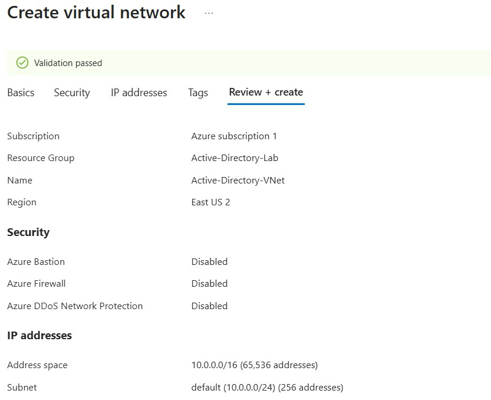
 

<h2>Step 1: Create Virtual Machines</h2>

One virtual machine is configured as a Domain Controller, while the second serves as a client workstation.

- <b>Domain Controller (DC)</b>
  - OS: Windows (Windows Server 2025 Datacenter Azure Edition)
  - VM Size: Minimum 2 vCPUs
  - Name: dc-01
  - Virtual Network: Previously created (Active-Directory-VNet)
  - Private IP: Static (important)

- <b>Client Machine</b>
  - OS: Windows (Windows 11 Pro)
  - VM Size: Minimum 2 vCPUs
  - Name: client-01
  - Virtual Network: Previously created (Active-Directory-VNet)

 
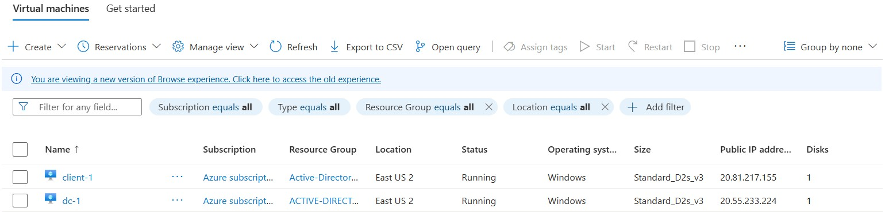
 

<h2>Step 2: Assign Domain Controller a static private IP address</h2>

- The Domain Controller (dc-1) is assigned a static private IP address to ensure stable network communication with domain-joined clients.

 
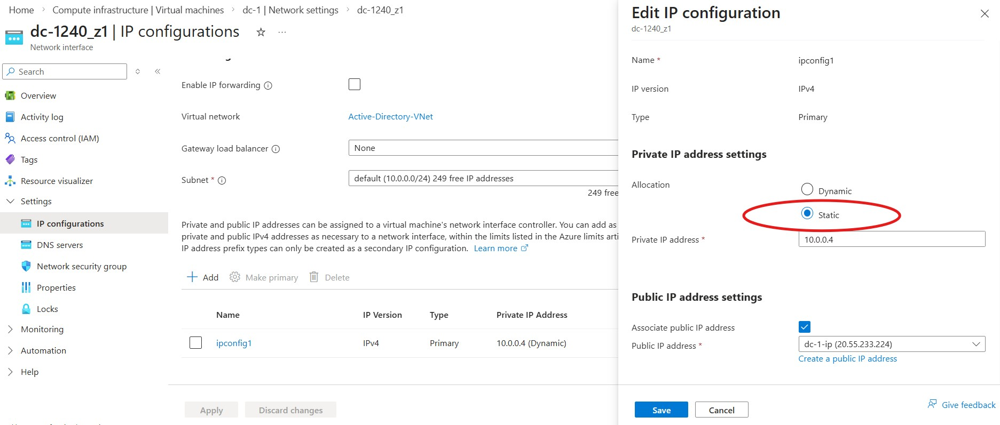
 

<h2>Step 3: Set client-1’s DNS settings to dc-1’s Private IP address</h2>

- client-1 is configured to use dc-1’s private IP address as its DNS server because Active Directory depends on DNS for domain discovery, authentication, and service location.

- This ensures the client can reliably locate the Domain Controller and interact with domain services within the virtual network.

 
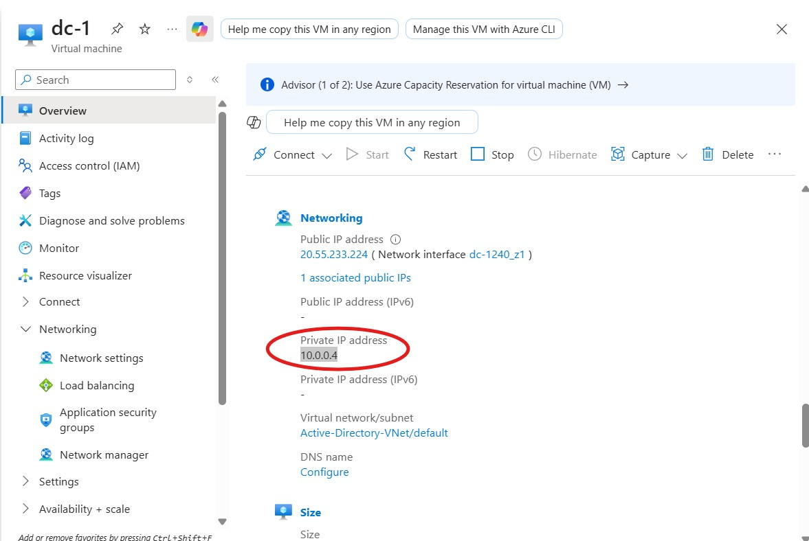
 

 
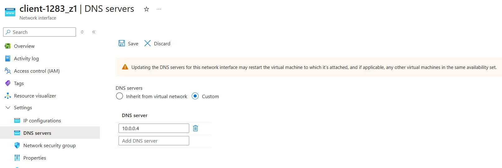
 

<h2>Step 4: Verify Connectivity</h2>

- To verify connectivity, the client machine (client-1) attempts to ping dc-1.

- (If request fails: check that both VMs are in the same network or if its due to ICMP traffic being blocked by the Windows firewall on the Domain Controller.)

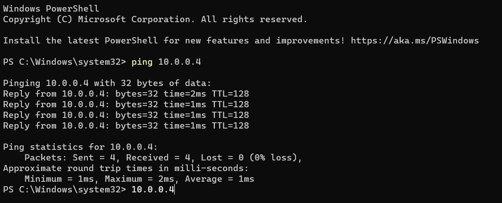

- Still in client-1, run ipconfig /all

  -The output for the DNS settings should show dc-1’s private IP Address

 
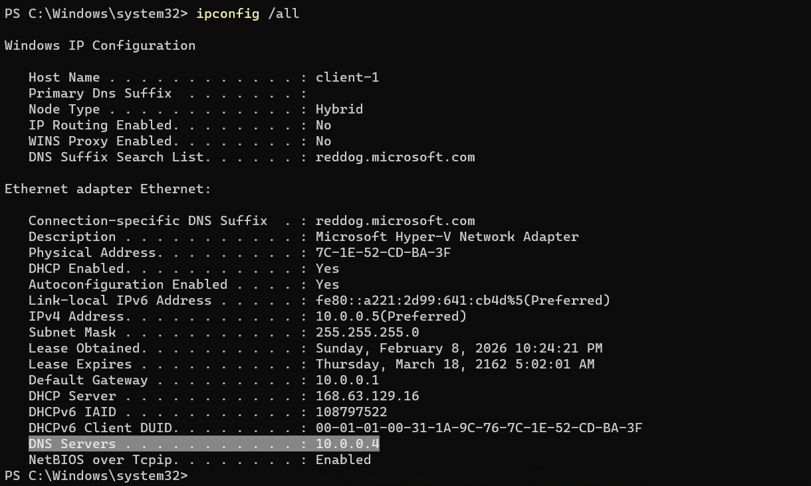
 

<h2>Step 5: Promote Server to Domain Controller</h2>

- <b>Install Active Directory Domain Services on dc-1</b>
  - Open <b>Server Manager</b>
  - Select <b>Add Roles and Features</b>
  - Install <b>Active Directory Domain Services</b>

 
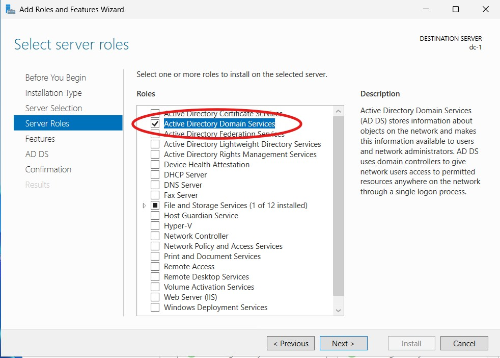
 

- <b>Promote dc-1 to a Domain Controller</b>
  - Select <b>Promote this Server to a Domain Controller</b>
  - Choose <b>Add New Forest</b>
  - Set Domain name to <b>mydomain.com</b>
  - Finish Installation

 
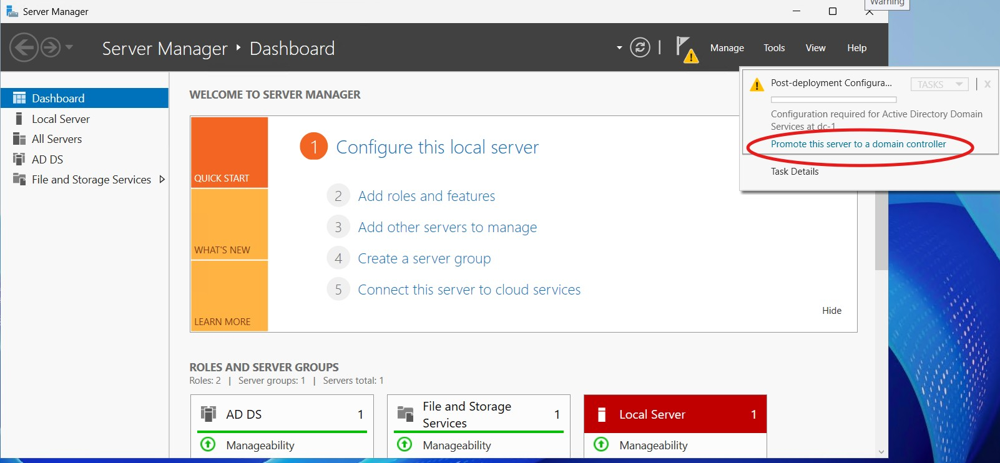
 

 
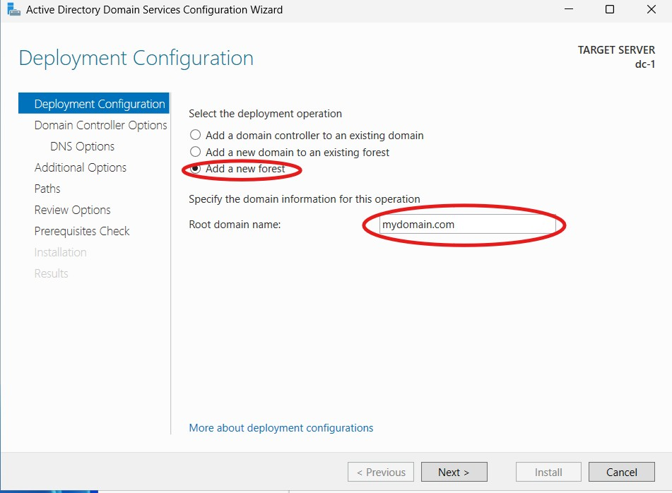
 

- After promotion, the system is restarted to apply the configuration changes.

- Once the restart is complete, dc-1 is accessed using the domain account mydomain.com\labuser.

<h2>Step 6: Create Organizational Units and Structure</h2>

1. Successful configuration is confirmed by launching <b>Active Directory Users and Computers</b>, indicating that the domain services are operational.

2. Organizational Units (OUs) are created to establish basic directory structure and administrative separation within the domain.

3. <b>Two OUs are defined at the domain level</b>

- \_EMPLOYEES
- \_ADMINS

 
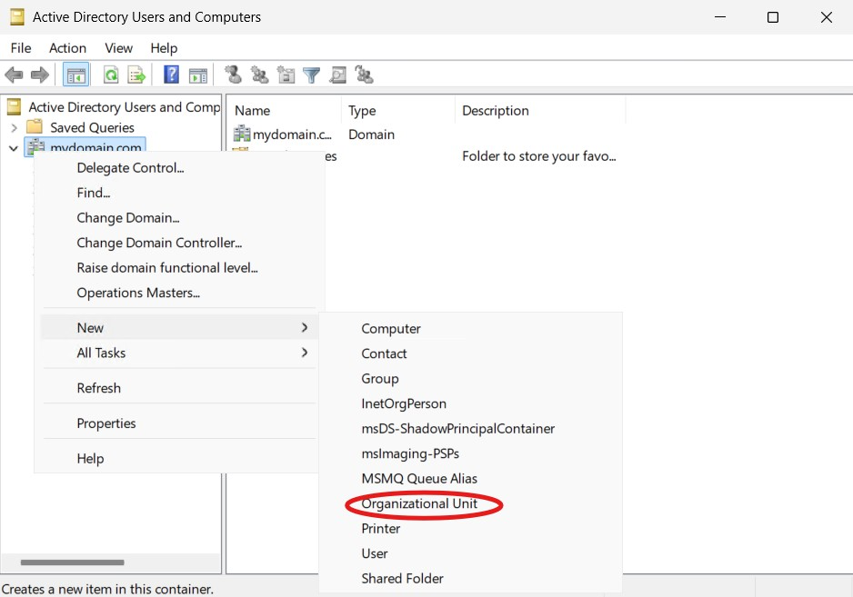
 

 
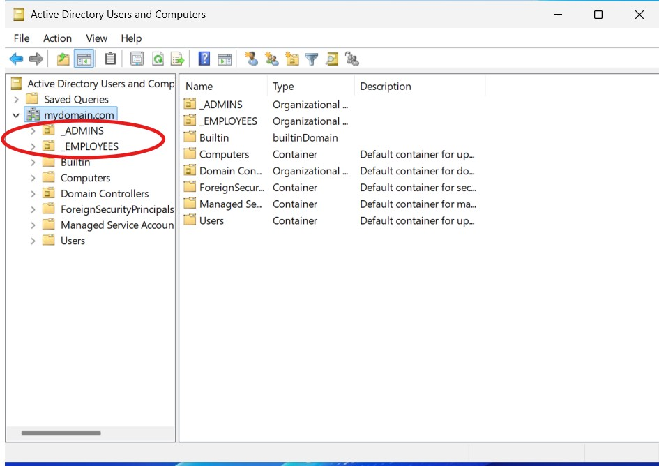
 
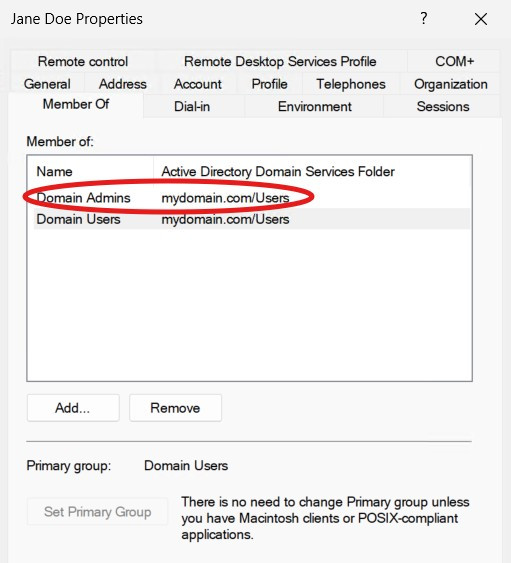
 

- The Jane_admin account is used as the administrative credential for subsequent domain operations.

<h2>Step 7: client-1 is joined to mydomain.com</h2>

1. client-1 is joined to the mydomain.com domain to complete the Active Directory integration.

- <b>While logged into client-1</b>
  - Select Windows <b>System</b>
  - Select <b>Advanced System Settings</b>
  - Select <b>Computer Name</b>
  - Set Domain name to <b>mydomain.com</b>
  - When finished, computer will automaticall restart.

 
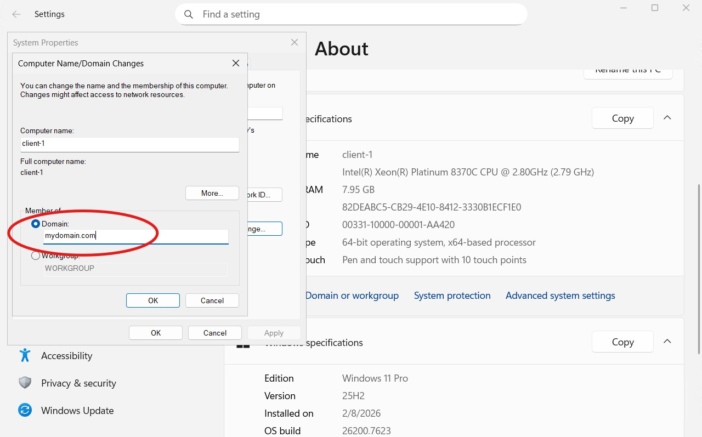
 

<h2>Promote Server to Domain Controller</h2>

1. After the restart, Client-1 is successfully enrolled in the domain and is managed under mydomain.com, confirming proper communication with the Domain Controller and Active Directory services.

 
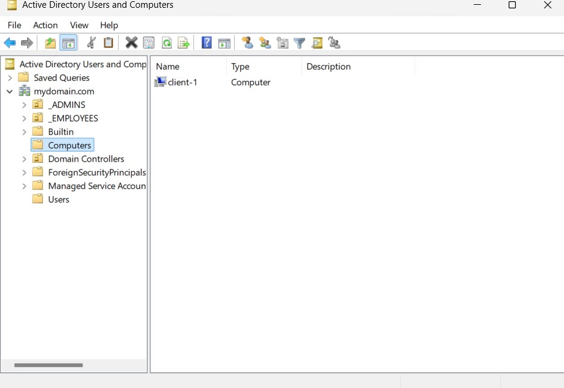
 

- With Client-1 successfully joined to the domain, Remote Desktop access is configured to support non-administrative domain users.

<h2>Step 8: Validate Remote Desktop Access</h2>

1.To validate Remote Desktop access for standard domain users, a user was created using the username "Tom Smith" and placed in the \_EMPLOYEES Organizational Group.

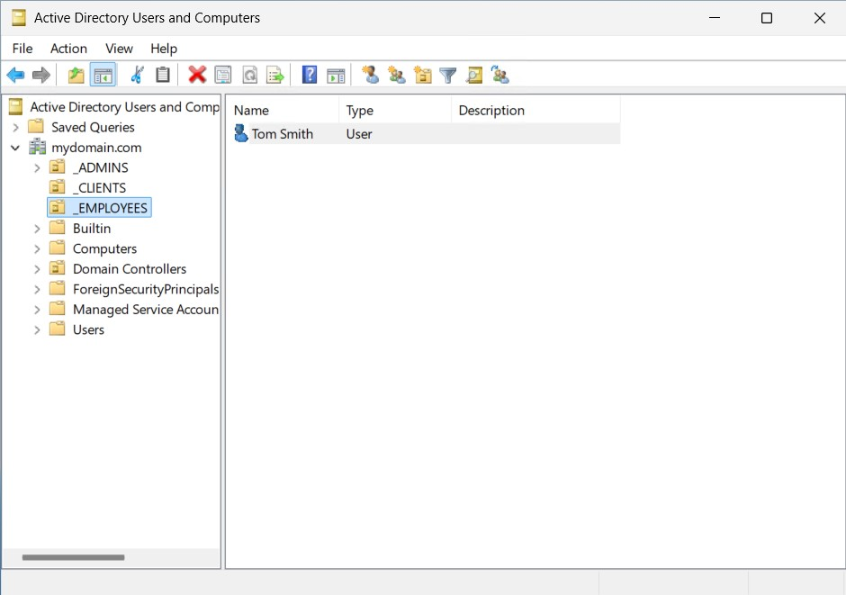

2. After the user is created, "Tom Smith" is selected and used to initiate a Remote Desktop session to client-1. Successful authentication and login confirm that domain users can access the client machine as intended.

3. This final step verifies both user provisioning and proper Remote Desktop access configuration for non-privileged accounts.
