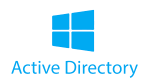
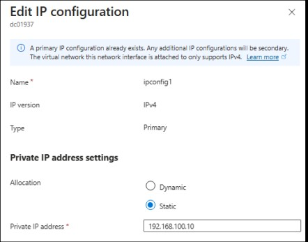
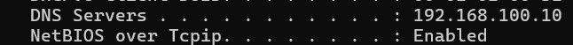
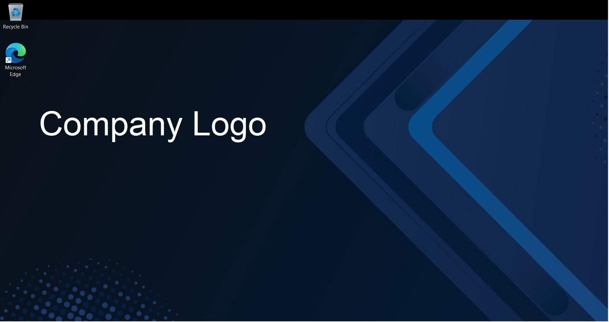

---

# Microsoft Azure Active Directory Lab (Cloud Edition)

---

## Overview

This lab demonstrates how to deploy an **Active Directory environment in Azure** using two virtual machines connected within a **Virtual Network**.  
It is designed for **hands-on demonstration**, showing how a Windows Server domain, client join, and Group Policies operate in a **cloud-based environment**.

---

## Key Components

| Component                        | Role                 | Description                                                    |
| -------------------------------- | -------------------- | -------------------------------------------------------------- |
| **DC01**                         | Windows Server 2025  | Hosts AD DS, DNS, and optional DHCP                            |
| **CLIENT01**                     | Windows 11 Pro       | Domain-joined client used for GPO testing                      |
| **Virtual Network (VNet)**       | Cloud Network        | Private IP space (192.168.100.0/24) for internal communication |
| **Network Security Group (NSG)** | Firewall             | Allows inbound RDP only from your public IP                    |
| **Resource Group**               | Management Container | Contains and organizes all Azure assets                        |
| **Access**                       | Connectivity         | Direct RDP (no Bastion) to minimize costs                      |

---

## Learning Objectives

- Deploy and configure **Active Directory Domain Services (AD DS)** in Azure
- Configure **NSG rules** to restrict RDP access securely
- Apply **Group Policy Objects (GPOs)** for centralized management
- Test **domain join and user permissions** between cloud VMs
- Practice **resource cleanup**

---

## Core Lab Setup

| Component                        | Purpose                               | Notes                                        |
| -------------------------------- | ------------------------------------- | -------------------------------------------- |
| **Resource Group**               | Logical container for Azure resources | Simplifies cleanup and management            |
| **Virtual Network (VNet)**       | Internal communication network        | 192.168.100.0/24 subnet                      |
| **Network Security Group (NSG)** | Firewall control                      | Restricts RDP to your public IP on port 3389 |
| **DC01 (Server)**                | Domain Controller                     | Runs AD DS, DNS, DHCP (optional)             |
| **CLIENT01 (Client)**            | Domain-joined workstation             | Used for GPO validation and login tests      |

---

## Key Group Policies Implemented

| GPO                          | Purpose                            | Result                                       |
| ---------------------------- | ---------------------------------- | -------------------------------------------- |
| **Disable Control Panel**    | Restrict access to system settings | “Restricted by your administrator” displayed |
| **Prevent Wallpaper Change** | Enforce corporate branding         | Company wallpaper applied across clients     |
| **Disable Task Manager**     | Block task termination             | Task Manager disabled for standard users     |
| **Allow RDP for HR Group**   | Grant limited RDP rights           | HR users can RDP into CLIENT01               |

---

## Technical Highlights

- **Secure RDP access** through NSG filtering (source IP restriction)
- **Custom DNS configuration** (192.168.100.10) for name resolution
- **Azure DHCP** automatically assigns internal IPs (no manual scope setup)
- **Group Policy enforcement** through Azure-hosted DC
- **Shared UNC path:** `\\DC01\Company\logo.jpg` used for wallpaper policy

---

## Validation Tasks

☑ AD DS installed and DC01 promoted successfully  
☑ CLIENT01 joined to `lab.local` domain  
☑ GPOs applied (`gpresult /h C:\GPOReport.html`)  
☑ Wallpaper and system restrictions verified  
☑ HR group RDP access validated  
☑ Azure resources deleted after testing

---

## Screenshots

| Image                                                                                                                              | Description                                                                                                                                                                                      |
| ---------------------------------------------------------------------------------------------------------------------------------- | ------------------------------------------------------------------------------------------------------------------------------------------------------------------------------------------------ |
|   | Resource Group created                                                                                                                                                                           |
|  | **Virtual Network `vnet-adlab`** : for secure internal communication between resources created                                                                                                   |
|  | **NSG rule allowing RDP from admin IP** : To securely manage the VM while blocking unauthorized access.                                                                                          |
|                                                        | **Configure DC01 static IP** : Ensures the Domain Controller always has a consistent IP address so clients can reliably locate DNS and authentication services without disruption.               |
|  | Windows Server 2022 (DC01) promoted to domain controller                                                                                                                                         |
|  | Windows 11 client joined to domain                                                                                                                                                               |
|                                                                | Confirmed the DNS server of CLIENT01 matches the IP of DC01                                                                                                                                      |
|  | **Control Panel GPO enforced** : To prevent users from making unauthorized system changes, enforce consistent configurations, and reduce support issues by limiting access to critical settings. |
|  | **Task Manager GPO** : To prevent users from terminating critical processes or bypassing restrictions, ensuring system stability and maintaining enforced security policies. enforced            |
|                                                           | RDP allowed for HR user and Wallpaper GPO applied                                                                                                                                                |

---

## Resource Allocation

| VM           | OS                  | vCPU | RAM  | Disk  | Role               |
| ------------ | ------------------- | ---- | ---- | ----- | ------------------ |
| **DC01**     | Windows Server 2025 | 2    | 4 GB | 60 GB | Domain Controller  |
| **CLIENT01** | Windows 11 Pro      | 2    | 4 GB | 60 GB | Client Workstation |

---

## Results

☑ Domain deployed successfully in Azure  
☑ CLIENT01 verified domain membership and GPO application  
☑ NSG confirmed secure RDP restriction  
☑ Cost estimation validated in Azure portal  
☑ All assets cleaned up post-lab to avoid charges

---

## Summary

## Summary

A **Microsoft Azure-hosted Active Directory lab** simulating an on-premises domain environment in the cloud.

Configured core components including **Domain Controller, Users, Groups, OUs, GPOs, and secure remote access (RDP/VPN)**.

Demonstrates hands-on experience with **identity management, access control, network security (NSGs), and system administration** in a scalable, cost-efficient environment.
